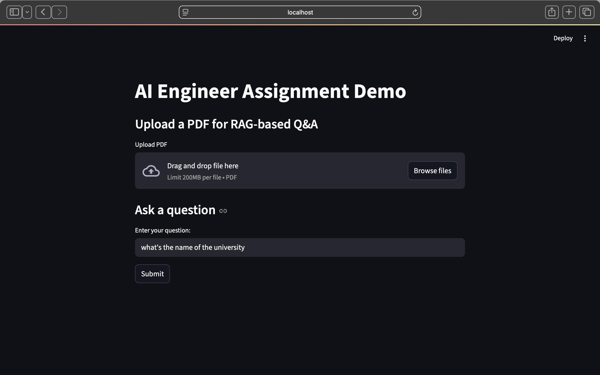

<<<<<<< HEAD
# weatherplusRAG
assignment - Neura Dynamics
=======

# Assignment - AI Engineer



## Setup Instructions

1. Clone the repository:
   ```bash
   git clone <repo-url>
   cd assignment-neuraDynamics
   ```

2. Install dependencies:
   ```bash
   pip install -r requirements.txt
   ```

3. Set your API keys and LangSmith tracing environment variables:
   ```bash
   export GOOGLE_API_KEY=your_google_api_key
   export QDRANT_API_KEY=your_qdrant_api_key
   export OPENWEATHER_API_KEY=your_openweather_api_key
   export LANGCHAIN_API_KEY=your_langchain_api_key
   export LANGSMITH_TRACING=true
   export LANGSMITH_API_KEY=your_langsmith_api_key
   ```

4. Run the Streamlit UI:
   ```bash
   streamlit run app.py
   ```

## LangSmith Tracing

LangSmith tracing is automatically enabled for all LangGraph and LangChain workflows when the environment variables above are set. No code changes are required—just run your pipeline as normal and view traces in the LangSmith dashboard.


## Implementation Details

- Uses LangGraph for agentic pipeline and decision node (see `agents/langgraph_pipeline.py`).
- Integrates LangChain for LLM and RAG.
- Embeddings generated and stored in Qdrant vector database.
- Weather data fetched via OpenWeatherMap API.
- RAG-based PDF QA using LangChain loaders and retrievers.
- LangSmith used for LLM response evaluation.
- Streamlit UI for chat interface demonstration.

## Deliverables

- Python code in this repository.
- LangSmith logs/screenshots in `langsmith_logs/`.
- Test results in `tests/`.
- Streamlit UI demo (`app.py`).
- Loom video link in this README.
>>>>>>> 2e96a541 (primary)
